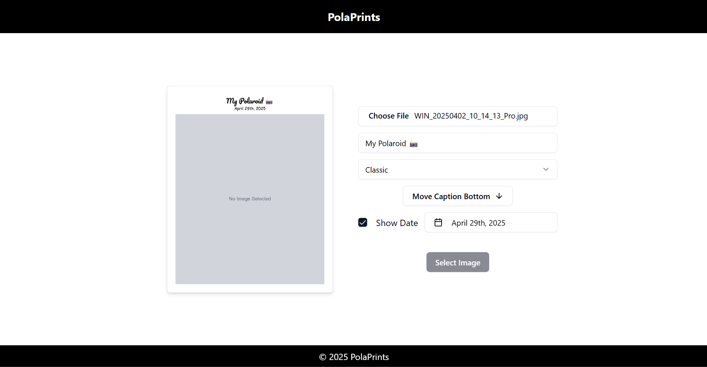

Absolutely! Here's the complete README.md file for your Polaroid Image Generator project:

markdown
Copy
Edit

# Polaroid Image Generator

A React/Next.js client-side app that lets users upload an image and generate a customizable polaroid-style photo with captions, frames, and dates. Built with the latest [shadcn/ui](https://ui.shadcn.com/) components and a custom canvas drawing implementation.

---

## Features

- Upload and preview images on a styled polaroid frame
- Customizable captions with position toggle (top/bottom)
- Show or hide date with a date picker
- Choose between multiple frame styles (Classic, Black, Retro)
- Download the generated polaroid image as a PNG file
- Reset all settings and image upload
- Responsive UI with Tailwind CSS and shadcn/ui components
- User feedback via toast notifications using `sonner`

---

## Demo

()

---

## Installation

1. Clone the repo:

```bash
git clone https://github.com/yourusername/polaroid-image-generator.git
cd polaroid-image-generator
```

Install dependencies:

```bash
Copy
Edit
npm install
# or
yarn install
```

Run the development server:

```bash
Copy
Edit
npm run dev
# or
yarn dev
Open http://localhost:3000 in your browser.
```

Usage
Click Choose File to upload an image.

Enter a caption in the text input.

Use the dropdown to select a frame style.

Toggle caption position between top and bottom.

Check/uncheck Show Date and pick a date from the calendar.

Click Download Polaroid to save the generated image.

Click Reset to clear all inputs and start over.

Technologies Used
React & Next.js (app router, client components)

TypeScript

Tailwind CSS

shadcn/ui components

date-fns for date formatting

sonner for toast notifications

HTML5 Canvas API for image composition

Folder Structure
bash
Copy
Edit
/app
/page.tsx # Main component with canvas and UI
/components # UI components and helpers (Button, Select, Calendar, etc.)
/lib
utils.ts # Utility functions like `cn`
/public
/fonts # Custom fonts (Pacifico) if needed
Notes
The project uses the Canvas API to draw the image and overlays captions and date.

The caption sanitization removes special characters to create safe filenames.

The sonner toast system provides instant feedback on errors or success.

The date picker uses shadcn/ui’s Calendar with a popover trigger.

This app requires no backend or external API; everything runs client-side.

License
This project is licensed under the MIT License. See the LICENSE file for details.

```

```
